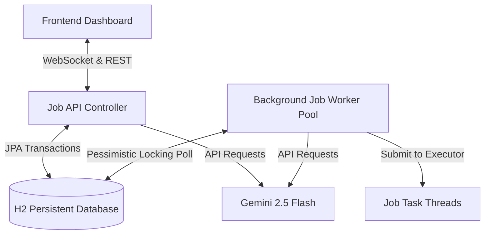

# JobCraft Orchestrator 🚀

A mini background job processor (inspired by Celery and BullMQ) built using **Spring Boot**, **JPA/H2**, **WebSockets**, and **Gemini AI**. 

Most students build standard CRUD applications. **JobCraft Orchestrator** is designed to stand out in SDE interviews by demonstrating deep familiarity with concurrency, thread pools, transaction-based row locking, exponential backoff failure handling, real-time event-driven push, and Agentic AI workflows.

---

## 🏗️ System Architecture



1. **Transactional Database Queue**: Using an H2 SQL database to store job state, enabling atomic operations, persistence, and reliability.
2. **Worker Pool Execution**: An internal `ThreadPoolExecutor` (fixed at 5 concurrent worker threads) pulls tasks from the database in transactional batches.
3. **Pessimistic Locking**: Prevents race conditions. When workers poll the database, they select rows using a `PESSIMISTIC_WRITE` lock (`SELECT ... FOR UPDATE`), claiming them by immediately moving their status to `RUNNING`.
4. **Real-time Synchronization**: A WebSocket STOMP endpoint broadcasts job state transitions (e.g. pending ➔ running ➔ completed/failed) instantly to the dashboard.
5. **AI Routing & Diagnostics**: 
   - **Agentic Router**: Takes natural language requests, parses intent via Gemini API, extracts variables, and submits the job.
   - **Failure SRE Diagnostic**: Triggers when a job lands in the Dead Letter Queue (DLQ), using Gemini to analyze the error logs and suggest actionable fixes.

---

## 🛠️ Tech Stack

- **Backend**: Java 25, Spring Boot 4.x, Spring Data JPA, Spring WebSocket
- **Database**: H2 (In-memory/File persistent)
- **Frontend**: Modern HTML5, CSS3 (Glassmorphism & animations), JavaScript (ES6), SockJS, STOMP.js
- **AI Integration**: Gemini API (via HTTP client)

---

## 🚀 Getting Started

### 1. Prerequisites
- **Java JDK 21+** (Java 25 recommended)
- **Node.js / NPM** (optional, only to run a local dev server for the frontend, or you can open the HTML file directly)

### 2. Setting Up the AI Layer
The AI Job Router and SRE Diagnostics require a Gemini API Key.
1. Get a free API key from [Google AI Studio](https://aistudio.google.com/).
2. Set it as an environment variable in your terminal:
   - **Windows (Command Prompt)**:
     ```cmd
     set GEMINI_API_KEY=your_api_key_here
     ```
   - **Windows (PowerShell)**:
     ```powershell
     $env:GEMINI_API_KEY="your_api_key_here"
     ```
   - **Linux/macOS**:
     ```bash
     export GEMINI_API_KEY="your_api_key_here"
     ```
   *(If the API key is not set, the project will automatically fall back to local rules-based routing and static warnings so that you can still evaluate all system operations.)*

### 3. Running the Backend
Navigate to the `backend/` folder and boot the Spring application using the Maven Wrapper:
```bash
cd backend
./mvnw spring-boot:run
```
*(On Windows PowerShell: `.\mvnw.cmd spring-boot:run`)*

The server will spin up on [http://localhost:8080](http://localhost:8080).
- You can inspect the database tables directly using the **H2 Console** at [http://localhost:8080/h2-console](http://localhost:8080/h2-console) (JDBC URL: `jdbc:h2:file:./data/jobsdb`, Username: `sa`, Password: empty).

### 4. Running the Frontend Dashboard
You can open `frontend/index.html` directly in your browser. Alternatively, serve it locally using a simple HTTP server:
```bash
cd frontend
# Using Node.js npx:
npx serve .
```
Open [http://localhost:3000](http://localhost:3000) (or the port specified by the server) to view the live dashboard.

---

## 🧪 How to Verify Core Features

1. **Prioritization**: Submit a few `LOW` and `MEDIUM` priority jobs. Then submit a `HIGH` priority job. Observe how the worker pool selects the `HIGH` priority job first once threads are free.
2. **Auto-Retry & Backoff**: Check the **Force execution failure** checkbox when submitting a job. The job will fail, trigger a retry, and schedule itself using an exponential backoff formula ($2^n$ seconds: 2s, 4s, 8s...). The status badge will show `RETRYING` and rotate.
3. **Dead Letter Queue (DLQ)**: Once a forced-failure job exceeds its maximum retry threshold (3 retries), it transitions to `DLQ` status in red.
4. **AI SRE Diagnostic**: Click on the red `DLQ` badge of a failed job. A diagnostic modal opens, showing the exact error log and the AI SRE diagnostic (populated asynchronously) suggesting a fix.
5. **Agentic Router**: In the AI panel, type: *"Send a welcome email to Sarah"* and click route. The AI will parse it as a `SEND_EMAIL` action with `HIGH` priority and payload `{"recipient":"Sarah", "template":"welcome"}` and dispatch it.

---

## 💻 Pushing to GitHub

To showcase this on your portfolio, follow these steps to add it to a new GitHub repository:

1. Create a new empty repository on your [GitHub account](https://github.com/new). Do not check "Add a README", ".gitignore", or "license" (we already have them).
2. Copy your repository's remote URL (e.g. `https://github.com/your-username/job-craft-orchestrator.git`).
3. Run the following commands in the project's root folder (`job-craft-orchestrator/`):
   ```bash
   # Add your remote URL
   git remote add origin https://github.com/your-username/job-craft-orchestrator.git
   
   # Set branch name to main
   git branch -M main
   
   # Push your code to GitHub
   git push -u origin main
   ```
