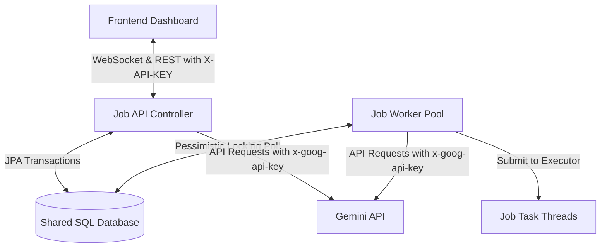

# Distributed Asynchronous Task Queue Console

A transaction-safe, distributed background job processing system built using Spring Boot, JPA persistence, WebSockets, and Java's ThreadPoolExecutor. It implements cell-level concurrency limits, transactional pessimistic row locking, exponential backoff retries, and AI-assisted failure diagnostics.

> **Note on Task Simulation**: For demonstration, benchmarking, and architectural evaluation, the worker execution logic (`SEND_EMAIL`, `RESIZE_IMAGE`, `GENERATE_REPORT`) is currently simulated using `Thread.sleep()` latency and payload-controlled failure triggers (`"forceFailure": true`). Replace the simulation blocks in `JobService.java` with real SMTP clients, image decoders, or report generators for production use.

---

## System Architecture



### 1. Database-Backed Queue & True Multi-Instance Concurrency
Utilizes a persistent relational database (H2 / PostgreSQL) as the shared task state store. Because task locking uses database-level `PESSIMISTIC_WRITE` locks (`SELECT ... FOR UPDATE`), **multiple backend instances can run concurrently against the same shared database** without duplicate executions or race conditions.

### 2. Concurrency & Locking Strategy
- **Pessimistic Row Locking**: When a worker node polls for runnable tasks, rows are selected with `PESSIMISTIC_WRITE` locks inside a transaction. The node claims the tasks by transitioning their status to `RUNNING` before committing and executing them.
- **Optimistic Locking (`@Version`)**: The `Job` entity includes a `@Version` field providing defense-in-depth against concurrent non-transactional state updates.
- **Fixed Thread Pool**: Worker threads within each instance are bounded by a fixed-size `ThreadPoolExecutor` (5 concurrent workers per node).

### 3. Fault Tolerance & Dead Letter Queue (DLQ)
- **Exponential Backoff**: Transient errors trigger automated retries scheduled using an exponential backoff formula ($2^{\text{attempt}}$ seconds: 2s, 4s, 8s...).
- **Dead Letter Queue**: When a task exceeds `maxRetries` (default: 3 attempts), it is transitioned to `DLQ` state for quarantine and inspection.

### 4. Security & API Protection
- **Header-based API Key Authentication**: All `/api/jobs/**` endpoints require an `X-API-KEY` header (configurable via `app.security.api-key`).
- **Configurable CORS**: Replaces open wildcards with an environment-driven origin whitelist (`app.cors.allowed-origins`).
- **AI Route Rate Limiting**: `POST /api/jobs/ai-route` includes a sliding-window rate limiter (default: 10 requests/minute) returning `429 Too Many Requests` when exceeded to protect Gemini quota.
- **Secure Gemini Authentication**: API keys are passed via the official `x-goog-api-key` header rather than URL query parameters.
- **Secured Database Console**: Remote access to the H2 console is disabled by default (`spring.h2.console.settings.web-allow-others=false`).

### 5. Real-Time Streaming & AI Diagnostics
- **WebSocket STOMP Broker**: Pushes real-time state changes (PENDING ➔ RUNNING ➔ COMPLETED/DLQ) to the frontend with sub-50ms latency.
- **Agentic Intent Router**: Parses natural language requests using Gemini, extracts structured JSON payloads, determines priority, and registers jobs autonomously.
- **SRE Failure Analyzer**: Evaluates DLQ exception logs asynchronously to propose actionable remediation steps in plain English.

---

## Tech Stack

- **Backend**: Java 25, Spring Boot 4.x, Spring Data JPA, Spring WebSocket
- **Persistence**: H2 Database (local file/memory) / PostgreSQL (multi-instance)
- **Frontend**: HTML5, Vanilla CSS3 (Smokey glassmorphic theme), JavaScript (ES6), SockJS, STOMP.js
- **AI Integration**: Gemini 2.5 Flash API (via Java HTTP client)

---

## Installation & Run Guide

### 1. Configure the Environment
Set the optional Gemini API key (defaults to local mock routing if unset) and custom API key:
- **Windows PowerShell**:
  ```powershell
  $env:GEMINI_API_KEY="your_gemini_api_key"
  $env:APP_API_KEY="dev-secret-api-key"
  ```
- **Linux/macOS**:
  ```bash
  export GEMINI_API_KEY="your_gemini_api_key"
  export APP_API_KEY="dev-secret-api-key"
  ```

### 2. Start Single-Instance Backend
Navigate to the `backend` folder and run:
- **Windows**:
  ```cmd
  .\mvnw.cmd spring-boot:run
  ```
- **Linux/macOS**:
  ```bash
  ./mvnw spring-boot:run
  ```
- Backend REST and WebSockets will be live at `http://localhost:8080`.
- H2 Console: `http://localhost:8080/h2-console` (JDBC URL: `jdbc:h2:file:./data/jobsdb`, Username: `sa`, Password: empty).

### 3. Start Frontend Dashboard
Serve the `frontend` folder using any static server:
```bash
cd frontend
npx serve .
```
- Open `http://localhost:3000` in your browser.

---

## Distributed Multi-Instance Deployment (Cluster Mode)

To run multiple worker nodes against a shared database, use the included `docker-compose.yml`:

```bash
docker compose up --build
```

This launches:
- `jobcraft-postgres`: Shared PostgreSQL database on port 5432.
- `jobcraft-node-1`: Worker instance #1 listening on port 8081.
- `jobcraft-node-2`: Worker instance #2 listening on port 8082.
- `jobcraft-frontend`: Nginx serving the dashboard console on port 3000.

Both worker nodes poll the same database table using `SELECT ... FOR UPDATE`, guaranteeing seamless distributed execution without task duplication.

---

## Verification Guide

1. **API Key Authentication**:
   ```bash
   # Should fail with 401 Unauthorized
   curl -i http://localhost:8080/api/jobs
   
   # Should succeed with 200 OK
   curl -i -H "X-API-KEY: dev-secret-api-key" http://localhost:8080/api/jobs
   ```

2. **Validation & Error Handling**:
   ```bash
   # Submitting invalid JSON payload returns 400 Bad Request
   curl -i -X POST http://localhost:8080/api/jobs \
     -H "X-API-KEY: dev-secret-api-key" \
     -H "Content-Type: application/json" \
     -d '{"type":"SEND_EMAIL","payload":"invalid-json"}'
   ```

3. **Concurrency Locking Integration Tests**:
   Run the automated test suite:
   ```bash
   ./mvnw test -Dtest=JobServiceIntegrationTest
   ```
   Verifies that concurrent parallel threads claiming runnable jobs never produce duplicate claims.

4. **Task Prioritization & Backoff**: Submit jobs via the UI or REST API with `"forceFailure": true` to inspect exponential backoff ($2^n$ seconds) and automatic DLQ transition with SRE diagnostics.
