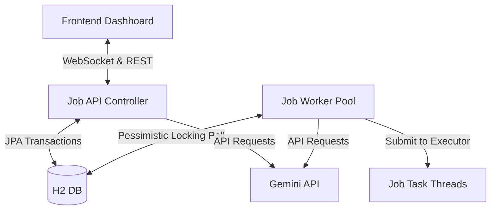

# Distributed Asynchronous Task Queue Console

A transaction-safe background job processing system built using Spring Boot, H2 persistence, WebSockets, and Java's ThreadPoolExecutor. It implements cell-level concurrency limits, transactional pessimistic row locking, backoff scheduling, and failure diagnostics.

## System Architecture



### 1. Database-Backed Queue
Utilizes a persistent relational database (H2) as the task store. This ensures durability, visibility into queue state, and cross-restart consistency.

### 2. Pessimistic Row Locking
To prevent race conditions where multiple workers try to claim the same task:
- The worker pool queries pending/retrying jobs inside a database transaction.
- The SQL query utilizes a `PESSIMISTIC_WRITE` lock (`SELECT ... FOR UPDATE`).
- Claimed jobs immediately transition to `RUNNING` within the transaction bounds before being submitted to worker threads, preventing double-processing.

### 3. ThreadPool Executor Concurrency
Background jobs are submitted to a fixed-size `ThreadPoolExecutor` (5 concurrent workers). The executor manages the active threads and queues overflow jobs gracefully.

### 4. Real-time Status Synchronization
Employs Spring's STOMP over SockJS WebSocket broker to broadcast job lifecycle updates (PENDING ➔ RUNNING ➔ COMPLETED/FAILED) in real-time.

### 5. AI Routing & Failure Diagnostics
- **Intent Router**: Parses natural language requests using the Gemini model, classifies the task type, extracts payload keys, schedules a priority level, and submits the job.
- **SRE Failure Diagnostics**: If a job fails and lands in the Dead Letter Queue (DLQ), the Gemini API is called asynchronously to analyze the error logs and suggest an actionable fix.

---

## Tech Stack

- **Framework**: Spring Boot 4.x, Spring Data JPA, Spring WebSocket
- **Persistence**: H2 Database (File persistent)
- **Frontend**: HTML5, Vanilla CSS3 (Glassmorphic panels), Javascript (ES6), SockJS, STOMP.js
- **LLM Integration**: Gemini API (Java HTTP client)

---

## Installation and Run Guide

### 1. Configure the Gemini API Key
The AI router and diagnostic analysis require a Gemini API Key.
- **Windows Command Prompt**:
  ```cmd
  set GEMINI_API_KEY=your_api_key_here
  ```
- **Windows PowerShell**:
  ```powershell
  $env:GEMINI_API_KEY="your_api_key_here"
  ```
- **Linux/macOS**:
  ```bash
  export GEMINI_API_KEY="your_api_key_here"
  ```
*(If the API key is not configured, the system falls back to local rules-based routing and static warnings automatically.)*

### 2. Start the Backend Server
Navigate to the `backend` folder and run the Maven wrapper command:
- **Windows**:
  ```cmd
  .\mvnw.cmd spring-boot:run
  ```
- **Linux/macOS**:
  ```bash
  ./mvnw spring-boot:run
  ```
- The backend API runs at `http://localhost:8080`.
- The database console is available at `http://localhost:8080/h2-console` (JDBC URL: `jdbc:h2:file:./data/jobsdb`, Username: `sa`, Password: empty).

### 3. Start the Frontend Server
Serve the `frontend` folder using any HTTP server:
```bash
cd frontend
npx serve .
```
- Open your browser to `http://localhost:3000` (or the port shown in your terminal).

---

## Verification Guide

1. **Task Prioritization**: Submit a mix of LOW, MEDIUM, and HIGH priority tasks. Observe how the worker pool selects the highest priority tasks first when thread capacity is reached.
2. **Backoff Scheduling**: Check "Force execution failure" on submission. The task will fail, trigger a retry, and reschedule itself using an exponential backoff formula ($2^{\text{attempt}}$ seconds: 2s, 4s, 8s...).
3. **Dead Letter Queue (DLQ)**: When a forced-failure task exceeds its maximum retry threshold (3 attempts), it moves to DLQ status.
4. **SRE Diagnostic Recommendation**: Click on a DLQ status badge to open the diagnostic window, displaying the error message and the AI SRE diagnostic recommendation.
5. **Agentic Router**: In the router box, type: `"Send a welcome email to John"` and dispatch. The AI parses the request into a SEND_EMAIL type, HIGH priority, and payload `{"recipient":"John", "template":"welcome"}` automatically.

---

## Repository Git Setup

To push this project to your GitHub repository:
```bash
git remote add origin https://github.com/ridhi001/Distributed-Task-Queue-System.git
git branch -M main
git push -u origin main
```
